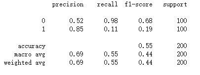

# COVID-19-Detection-using-Chest-Xray

## Motivation

As we know, we are in the tight hold of a pandemic which has its disastarous effect on this world. We are standing together even while physically distancing ourselves, protecting others and caring for others in this dreadful times. Humanity still deserved to live for million years. But we should contribute our role in this fight against an invisible enemy. 

Many Data Scientist are working getting predictions and developing models for strategies. We can assist HealthCare workers and Doctors by developing a AI Assistment or Model. A Image Classification model can handle a lot of worries for Doctors, especially in X Ray Diagnosis.

In this project, I would train a CNN classifier which can classify COVID-19 Infected Lung Xray images from Healthy Lung Xray images. For that we need dataset from both classes, I used the dataset from two sources,

- Cohen's [COVID Chest X-ray Dataset](https://github.com/ieee8023/covid-chestxray-dataset) 
- Paul Mooney's [Chest X-ray Dataset (Pneumonia)](https://www.kaggle.com/paultimothymooney/chest-xray-pneumonia)

**I am very thankful to the great efforts by the Open-Source Community for collecting data in a repository. It is important for me to complete this project.**

## Make model confess

We use DenseNet-121 Architecture as the core here for our DL Model. We also use pre-trained weights as a means to Transfer Learning. To learn and achieve higher accuracy on our model faster.

Transfer Learning is a powerful technique that we use in Deep Learning, which is we use the model parameters which are already trained on a larger dataset (ie.ImageNet Dataset consist of 1000 Classes). For instance, its process of transfering the Knowledge of a learnt man into another. Pretrained model will already trained to extract micro features like curves and lines. We will have the previous knowledge to initalize with and we can train the model to look for what it should look.

More about Densenets here in this [paper](https://arxiv.org/abs/1608.06993).

I am traning all the the Layers, instead of freezing CNN Layers and training only the Fully Connected Layer (Classification Layer) like most people do in Classification Task. Since we are handling Medical Images here we have to train the CNN layers completely or Partially.

### Model performance

